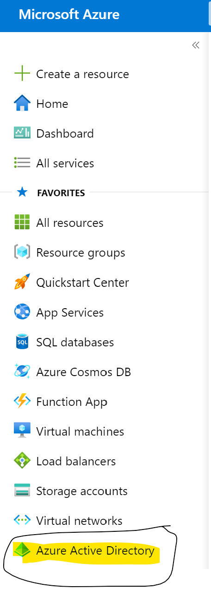
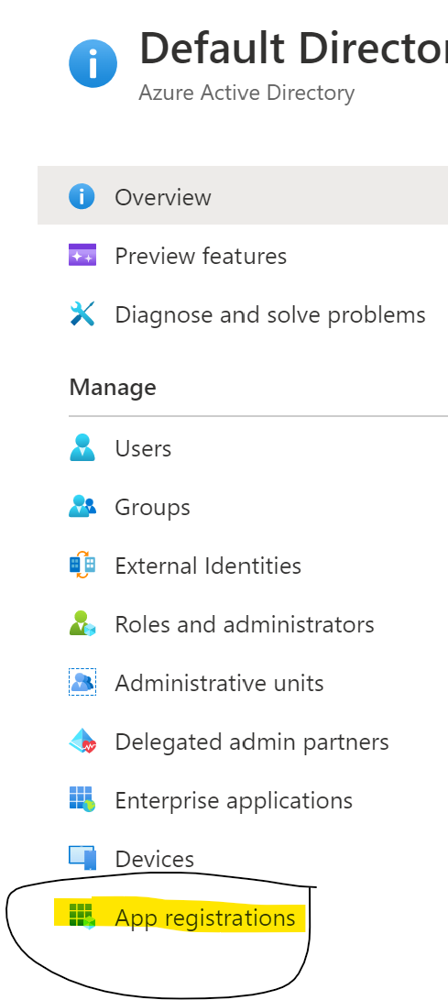
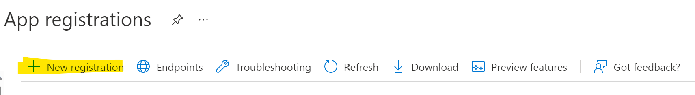
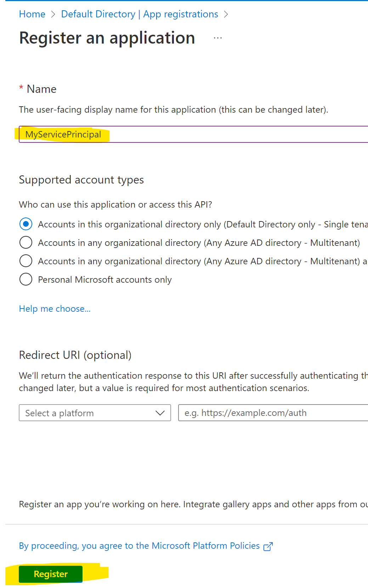
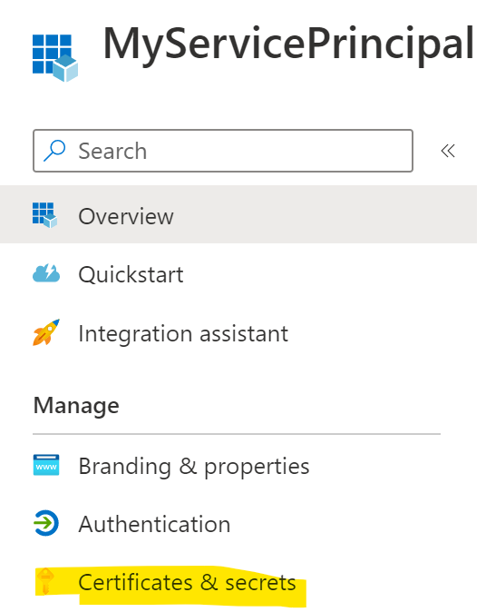
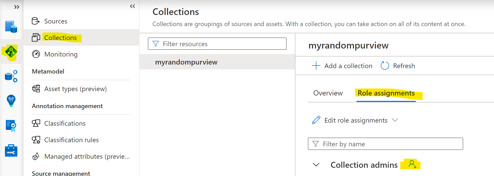

## What is a Service Principal and Why is it Needed?

Think of a Service Principal as an entity in Azure that can be assigned permissions. 

 
One of the benefits of a Service Principal is it can be used to connect with Azure resources in a safer way than a user passing in their username/password.

 
For example, imagine a developer named Frank. If Frank wanted to call Purview APIs, how would he connect with Purview?

 
He could provide his username and password in the script. This is very dangerous because if a hacker gets a hold of the info or it gets leaked, the hacker not only has access to use the Purview APIs but any other potential resources Frank has access to!

 
On top of that, what if Frank's colleauge Mary wanted to call Purview APIs too? She would either have to get Frank's credentials or use her own. Now we have two developer credentials that are potentially exposed.  

To help solve this, Service Principals can be used. When a Service Principal is created, it gets assigned a clientid (think of it as a username) and a clientsecret (password) and we can assign the Service Principal only the Purview permissions needed.

Now if Frank or Mary want to call Purview APIs, they can both use the Service Principal information. It keeps their credentials protected and if a hacker were to get the Service Principal info, they only have access to call the Purview APIs assigned to it versus exposing additional resources or access. If compromised, it's much easier to delete a Service Principal and create another one than reset Frank's password and all related info. 

## How to Create a Service Principal
There are several ways to create a Service Principal. We will create one below using the Azure Portal. For additional ways, see: [Create a Service Principal](https://learn.microsoft.com/en-us/azure/active-directory/develop/howto-create-service-principal-portal)

The first step is to go to the Azure Portal and sign into your account:
**[portal.azure.com](https://portal.azure.com)**

Once in the portal, click on the Azure Active Directory icon on the left of the screen:

Click on app registrations on the left:

Click on New Registration in the top toward the middle of the page:

Type in a Name for the Service Principal and hit register at the bottom (optionally, create a URL per the options listed):

Once created, the application (clientid) will be shown. To create a clientsecret (password), click on Certificates and Secrets on the left side:

Click on new client secret in the middle of the page:

Click add in the next screen (optionally, provide a description and expiration). Once created, the random string shown under the value tab is the clientsecret (password).

## How to Assign the Service Principal the Collection Admin Role in Purview

The last step is to assign the Collection Admin role (in order to call the Purview APIs with the Service Principal). Go into your Purview application (for help, see: [Create a Purview Resource](./tutorial/create-purview.md) click on the diamond shaped icon on the far left, click on collections, click on role assignments in the middle of the page and click the person+ icon next to collection admins:

Search for the name of the Service Principal in the search bar and click ok at the bottom.

