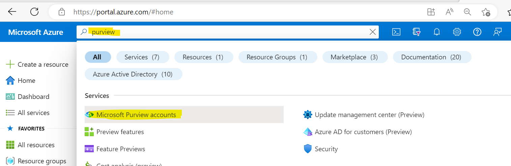

### Overview 

There are two main ways to authenticate to Purview:

1. With a Service Principal
2. With the azure-identity Python package 

### Authenticating with a Service Principal 

To authenticate with a Service Principal, import the ServicePrincipalAuthentication and PurviewCollection classes 
```Python
    from purviewautomation import ServicePrincipalAuthentication, PurviewCollection
```

Then create a variable named **auth** (can be named anything) and add the tenantid, client id and client secret:

```Python
    auth = ServicePrincipalAuthentication(tenantid=yourtenantid, 
                                          clientid=yourclientid, 
                                          clientsecret=yourclientsecret)
```

Lastly, create a variable named **client** (can be named anything) and instantiate the class with your Purview account name and the auth variable created in the previous step

```Python
    client = PurviewCollections(purview_account_name=yourpurviewaccountname,
                                auth=auth)
```

Use the client object to interact with the collections. Ex: `print(client.list_collections())`

### Authenticating with the azure-identity Python package

To authenticate using the azure-identity Python package, first install the package 
    
```Python
    pip install azure-identity
```


