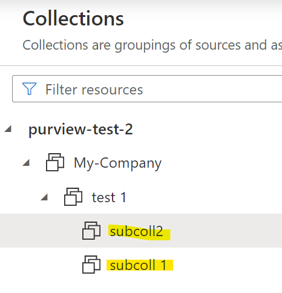
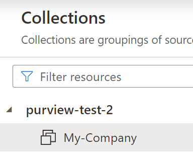

### Overview 
::: purviewautomation.collections.PurviewCollections.create_collections
    options:
        heading_level: 0

!!! important
    - Code will automatically trim leading and trailing whitespaces in the collection names. 
        - Ex: `" test1"`, `"test1 "`, `"    test1    "` would all equal `"test1"`
      - When creating a collection hierarchy [See: Collection Hierarchies](#create-one-collection-hierarcy), the code trims leading/trailing whitespaces before and after the `/`. Ex: `"test1 / test 2"` would equal `"test1/test2"` (test1 is one collection and test2 is another collection). 
    - Spaces in names are allowed: `"my collection"` is different than `"mycollection"`. 
    - Multiple spaces are allowed: `"my new collection"`  
    - Collection names are case sensitive. `"My-Company"` and `"my-company"` are two different names.

## **Examples**
The start_collection has to already exist in Purview. Pass in either the friendly name or the real name of the collection.


   

### **Create One Collection**
If the Purview collections look like this:


**Example 1: Create one collection starting from any of the three listed (purview-test-2, My-Company, test 1):**
```Python
client.create_collections(start_collection="purview-test-2", 
                          collection_names="new collection 1"
                        )
```
This will create a collection under purview-test-2 (same level as the My-Company collection):


**Example 2: Create from `test 1`. `sub test coll` will be listed as a child of `test 1`. The keyword arguments can be ommited if desired:**
```Python
client.create_collections("test 1", "sub test coll")
```


### **Create Multiple Collections**
To create multiple collections, pass in a list to the collection_names parameter. The `subcoll1` and `subcoll2` collections would be children of `test 1`:
```Python
client.create_collections(start_collection="test 1", ["subcoll 1", "subcoll2"])
```


**Example 2: Create four collections under `subcoll 1`:**
```Python
colls = ["newcoll1", "newcoll2", "Random Collection", "Another Random Collection"]
client.create_collections("subcoll 1", colls)
```


### **Create One Collection Hierarcy**
To create a collection hierarchy, add `/` for parent/child relationships.
If the Purview collections look like this:



Example 1: Create a collection hierarchy under `My-Company`. `subcoll1` would be a child under `My-Company` (referenced by the `/`), `subcoll2` would be a child under `subcoll1`, and `sub coll 3` would be a child under `subcoll 2`
```Python
client.create_collections(start_collection="My-Company", 
                          collection_names="subcoll1/subcoll2/sub coll 3"
                        )
```


### **Create Multiple Collection Hierarchies**
If the Purview collections look like this:


Example 1: Create two collection hierarchies under `My-Company`, pass in a list of hierarchies:
```Python
first_hierarchy = "test 1/test 2/test 3/test4"
second_hierarchy = "second test 1/secondtest2/second test 3/ second test4"

client.create_collections(start_collection="My-Company",
                          collection_names=[first_hierarchy, second_hierarchy])
```


Hierarchies can be of different length. Create three hierarchies under `My-Company`:

```Python
short_hierarchy = "First Collection/Second Collection"
longer_hierarchy = "Longer Hierarhcy/Longer Hierarchy2/Another Collection"
even_longer_hierarchy = "long hier1/long hier2/long hier3/long hier4/long hier5"

client.create_collections("My-Company", 
                          [short_hierarchy, longer_hierarchy, even_longer_hierarchy]
                        )
```

