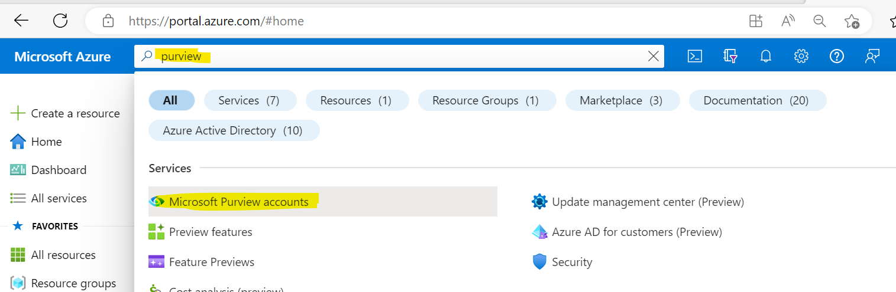
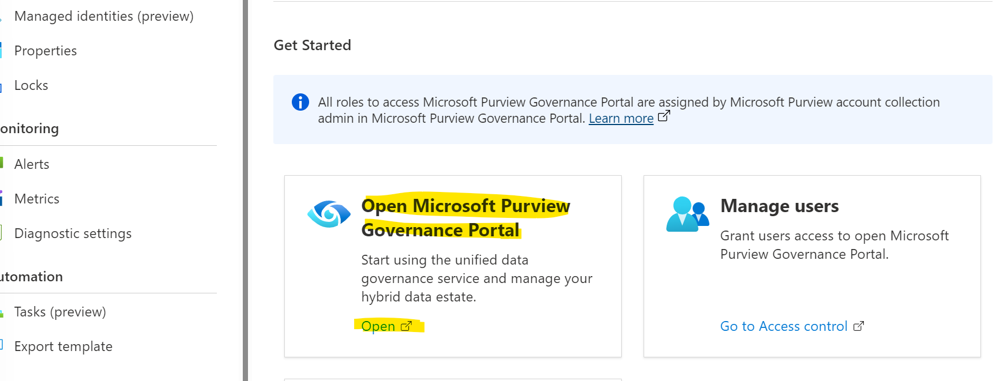

### What is Purview?
Purview is a data governance tool to help organizations govern, protect, and manage their data estate. For more information, see: [Purview Overview](https://learn.microsoft.com/en-us/purview/purview).

### How to Create a Purview Resource
There are several ways to create a Purview resource, below are just two ways:

1. [Azure Portal](#azure-portal) 
2. [Azure Command Line ](#azure-command-line)

### Azure Portal 
Go to **[portal.azure.com](https://portal.azure.com)** and sign into your account. 

Click on the search bar, type in purview and click on Microsoft Purview accounts:

Follow the remaining instructions from the portal to finish creating the Purview account.

Once the resource is created, go back to the portal main page and in the search bar type in Purview, click on the Microsoft Purview accounts, find the Purview resource and then in the middle click on Open Microsoft Purview Governance Portal to go inside the application:

### Azure Command Line
Go into your code editor of choice (Visual Studio Code, PyCharm, etc.) and install the Azure CLI:
**[Install Azure CLI](https://learn.microsoft.com/en-us/dotnet/azure/install-azure-cli)** 

Follow these steps to create Purview via the Azure CLI:
**[Create Purview With Azure CLI](https://learn.microsoft.com/en-us/cli/azure/purview/account?view=azure-cli-latest#az-purview-account-create)**

!!!important
    If creating a Purview account via a Service Principal, you may need to add yourself as a root collection admin in order to enter the application as shown earlier. To add yourself as a collection admin, follow the instructions here: [Add a Root Collection Admin](https://learn.microsoft.com/en-us/azure/purview/catalog-permissions)  

Now that a Purview resource has been created (or already existed), let's move on to see how to connect to Purview.