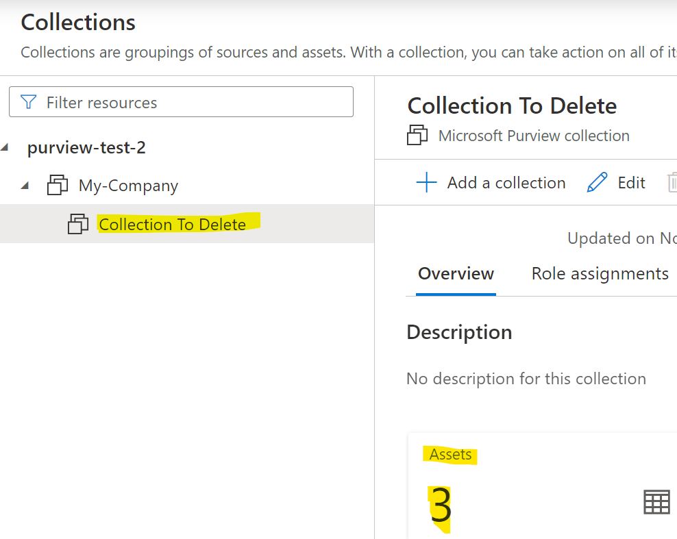
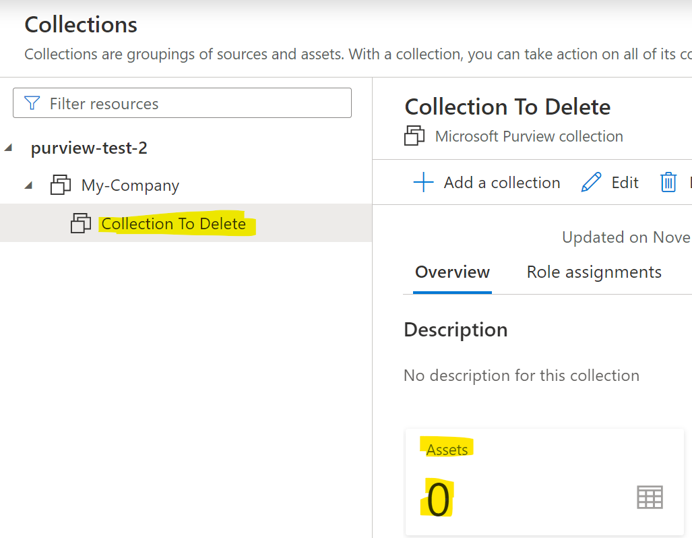
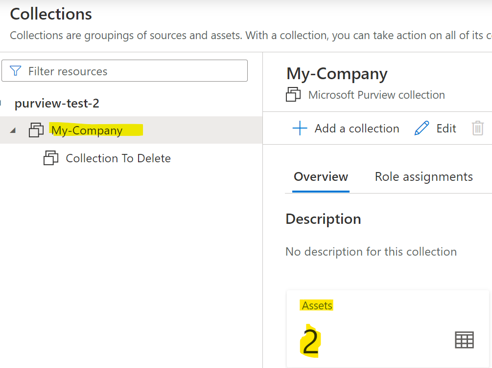
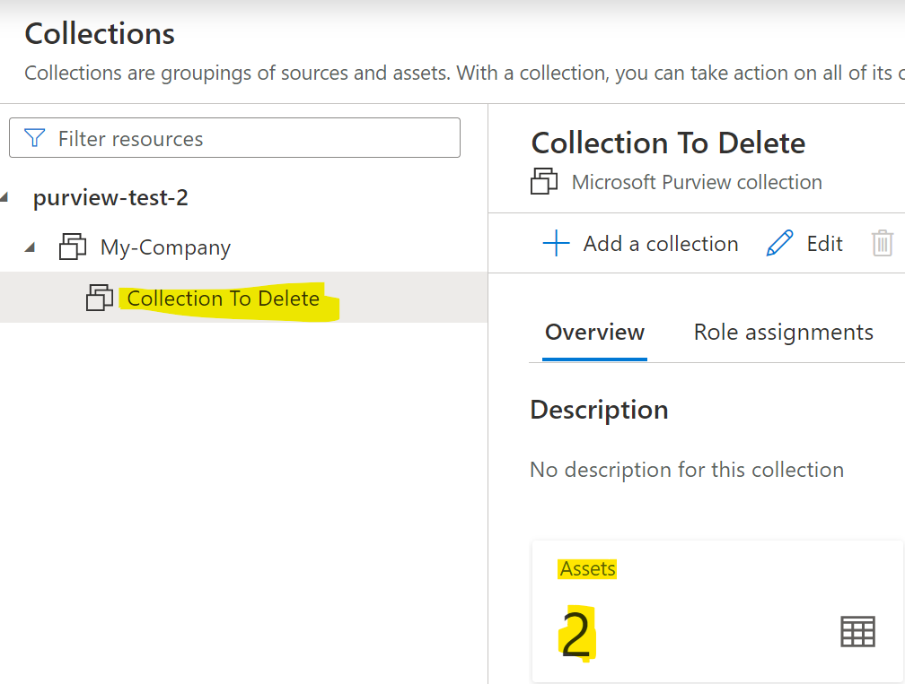
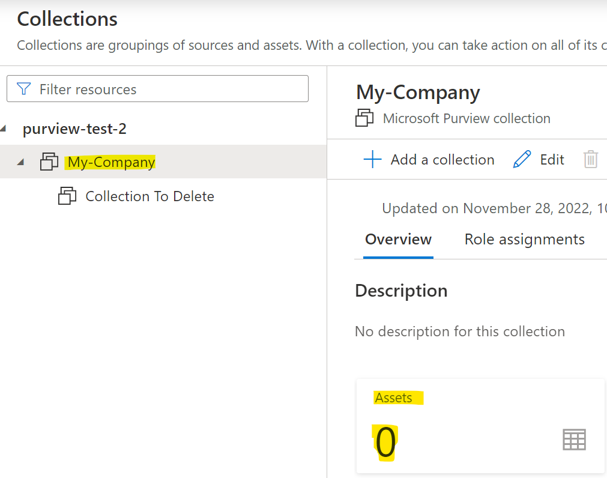
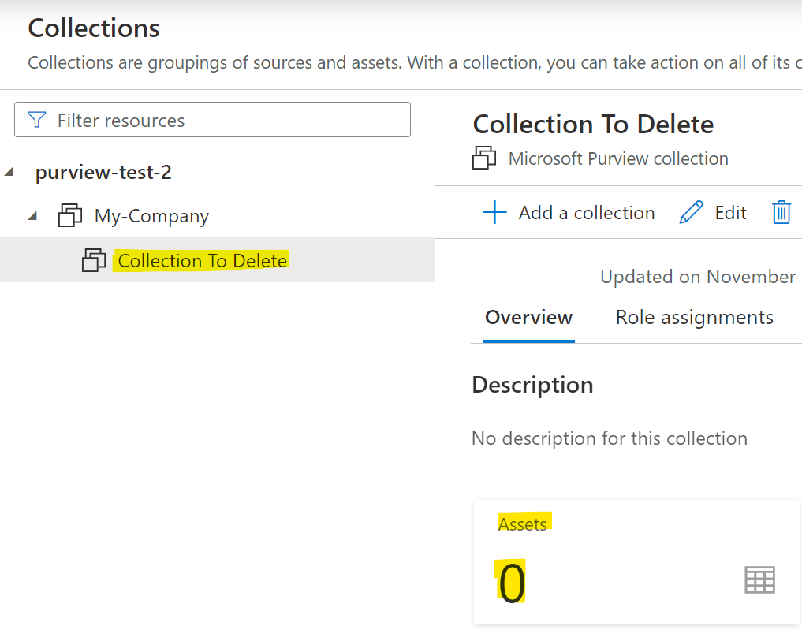

### Overview
::: purviewautomation.collections.PurviewCollections.delete_collection_assets
    options:
        heading_level: 0

!!! Important
    !!! Important
    **The Service Principal or user that authenticated/connected to Purview would need to be listed as a Data Curator on the collection in order to delete assets in that collection. For more info, see: [Purview Roles](https://learn.microsoft.com/en-us/azure/purview/catalog-permissions)** 

    **The timeout when running delete_collection_assets is 30 minutes. If there are a large number of assets in the collection, pass an integer to the timeout parameter (in minutes) to increase (or decrease) the time.**

    For example, `client.delete_collection_assets(collection_names="My Collection", timeout=60)` will allow the code to run up to one hour (60 minutes). 
    
    If assets are deleted faster than one hour (only takes one minute to delete the assets) the code will stop after a minute (or whenever all of the assets are deleted). 


## Examples

### Delete All Assets in One Collection
The below Purview has a collection called `Collection To Delete` that has 3 assets:



To delete all of the assets in the collection:
```Python
client.delete_collection_assets(collection_names="Collection To Delete")
```

Refresh Purview to see that all of the assets have been deleted:



### Delete All Assets in Multiple Collections

!!! Info
    The collections don't have to be in the same hierarchy. They can be located in any hierarchy.

In the below Purview, the collections `My-Company` and `Collection To Delete` both have two assets:





To delete all the assets in both collections:
```Python
collections = ["My-Company", "Collection To Delete"]
client.delete_collection_assets(collection_names=collections)
```
Output:





### Handling Duplicate Friendly Names

In the event there's multiple duplicate friendly names/edge cases, see: [Handeling Multiple Duplicate Friendly Names](../handeling-multiple-duplicate-friendly-names.md).

