### Overview
::: purviewautomation.collections.PurviewCollections.delete_collections_recursively
    options:
        heading_level: 0

!!! important
    - This method only deletes collections that have children (sub collections). To delete collections that have no children, see [Delete Collections](delete-collections.md) 
    - Collection names are case sensitive. `My-Company` is different than `my-Company`.

    - To delete collections that also have assets, add the delete_assets parameter see: [Delete Assets Section](#delete-assets)

## Examples

### **Delete One Collection Hierarchy**
Given the below Purview:

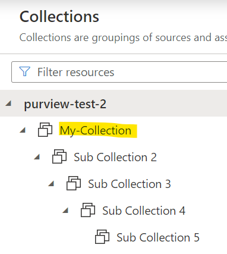

To delete all of the collections under `My-Collection`:
```Python
client.delete_collections_recursively(collection_names="My-Collection")
```
The output printed to the screen:


Purview after running the code:

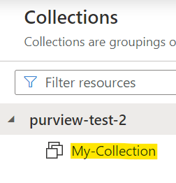


### **Delete One Collection Hierarchy Along with the Initial Collection**

Given the below Purview:


To delete all of the collections under `My-Collection` and also delete `My-Collection` as well, pass in `True` to the `also_delete_first_collection` parameter:

```Python
client.delete_collections_recursively(collection_names="My-Collection",
                                     also_delete_first_collection=True)
```
Purview after running the code where `My-Collection` along with the child collections are deleted:

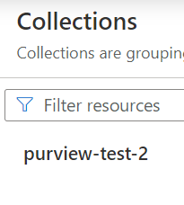

### **Delete Multiple Collection Hierarchies**

Given the below Purview:

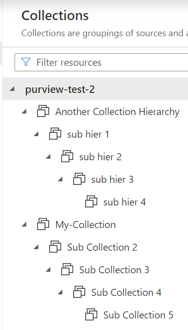

To delete all of the collections under `Another Collection Hierarchy` and under `My-Collection`:

```Python
collections = ["Another Collection Hierarchy", "My-Collection"]
client.delete_collections_recursively(collection_names=collections)
```

Purview after running the code:

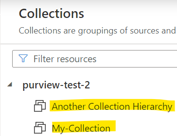

### **Rollback/Safe Delete**
When deleting collections, passing in the safe_delete parameter will output the collection/s that were deleted in order to recreate the collection. Think of this as a rollback option.

Given the below Purview:


This will delete all of the collections under `My-Collection` and output (print to the screen) the exact script to recreate the entire hierarchy. The actual names and friendly names are all the same:

```Python
client.delete_collections_recursively(collection_names="My-Collection", 
                                      safe_delete="client")
```

Purview output:

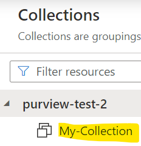

The exact script will also output (print to the screen). Simply copy and then run the code recreate the entire hierarchy or save it in a file to be used later:

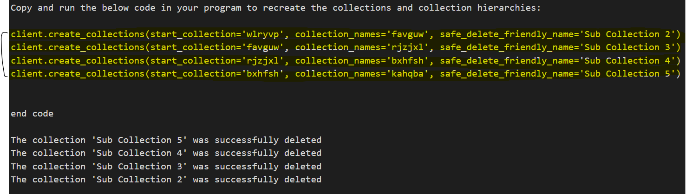

Run the code as shown above:

```Python
client.create_collections(start_collection='wlryvp', collection_names='favguw', safe_delete_friendly_name='Sub Collection 2')
client.create_collections(start_collection='favguw', collection_names='rjzjxl', safe_delete_friendly_name='Sub Collection 3')
client.create_collections(start_collection='rjzjxl', collection_names='bxhfsh', safe_delete_friendly_name='Sub Collection 4')
client.create_collections(start_collection='bxhfsh', collection_names='kahqba', safe_delete_friendly_name='Sub Collection 5')
```

Purview output after the code runs will recreate the entire hierarchy:

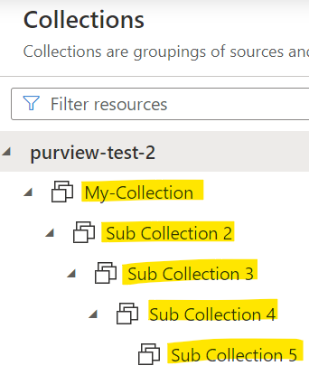


### **Delete Assets**
To delete all of the assets in a hierarchy (delete all of the assets in every collection in the hierarchy), use the `delete_assets` parameter with the optional `delete_assets_timeout` option:

!!! Important
    **The Service Principal or user that authenticated/connected to Purview would need to be listed as a Data Curator on the collection in order to delete assets in that collection. For more info, see: [Purview Roles](https://learn.microsoft.com/en-us/azure/purview/catalog-permissions)** 

    Deleting assets in a collection is irreversible. Re-scan the deleted assets to add them back to the collections.

    The code will delete all of the assets and the collection hierarchy. To only delete assets and not delete the collections, see: [Delete Collection Assets](./delete-collection-assets.md)

    The root collection (top level collection) can't be deleted. In the examples above, `purview-test-2` is the root collection. To only delete the assets, see: [Delete Collection Assets](./delete-collection-assets.md)

!!! Info
    **The timeout when deleting assets is 30 minutes. If there are a large number of assets in the collection, pass an integer to the timeout parameter (in minutes) to increase (or decrease) the time.**

    For example: `client.delete_collections_recursively(collection_names="My Collection", 
    delete_assets=True, delete_assets_timeout=60)` will allow the code to run up to one hour (60 minutes).
    
    If assets are deleted faster than one hour (only takes one minute to delete the assets) the code will stop after a minute (or whenever all of the assets are deleted). 

The below Purview has assets in multiple collections under `My-Collection` (`Sub Collection 2` has two assets and `Sub Collection 3` has three assets):

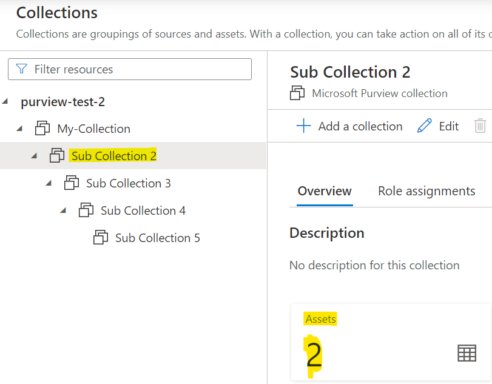
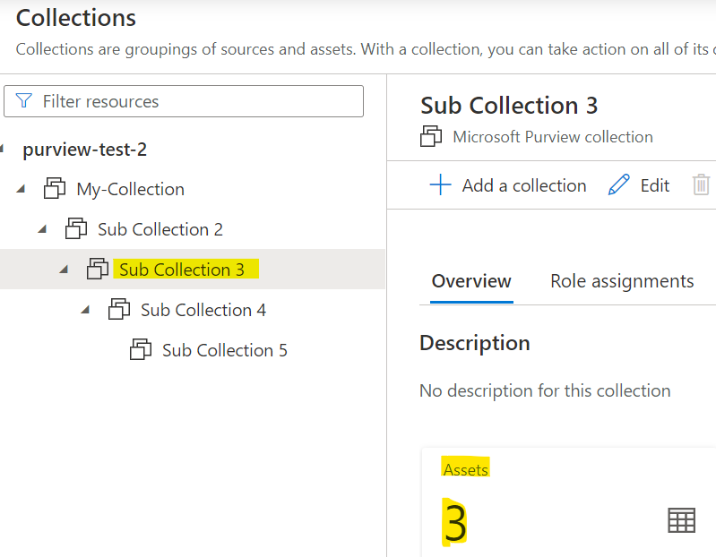


To delete all of the assets and all of the collections under `My-Collections`:

```Python
client.delete_collections_recursively(collection_names="My-Collections",
                                      delete_assets=True)
```                                      

The resulting Purview:

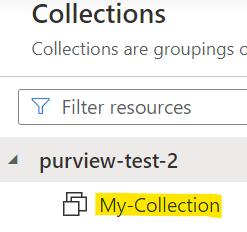


