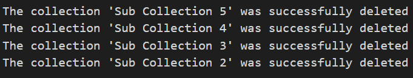

### Overview
::: purviewautomation.collections.PurviewCollections.delete_collections_recursively
    options:
        heading_level: 0


## Examples

### Delete One Collection Hierarchy
Given the below Purview:


To delete all of the collections under `My-Collection`:
```Python
client.delete_collections_recursively(collection_names="My-Collection")
```
The output printed to the screen:



Purview after running the code:


### Delete One Collection Hierarchy Along with the Initial Collection

Given the below Purview:


To delete all of the collections under `My-Collection` and also delete `My-Collection` as well, pass in `True` to the `also_delete_first_collection` parameter:

```Python
client.delete_collections_recursively(collection_names="My-Collection",
                                     also_delete_first_collection=True)
```
Purview after running the code where `My-Collection` along with the child collections are deleted:


### Delete Multiple Collection Hierarchies

Given the below Purview:


To delete all of the collections under `Another Collection Hierarchy` and under `My-Collection`:

```Python
collections = ["Another Collection Hierarchy", "My-Collection"]
client.delete_collections_recursively(collection_names=collections)
```

Purview after running the code:


### Rollback/Safe Delete
When deleting collections, passing in the safe_delete parameter will output the collection/s that were deleted in order to recreate the collection. Think of this as a rollback option.

Given the below Purview:


This will delete all of the collections under `My-Collection` and output (print to the screen) the exact script to recreate the entire hierarchy. The actual names and friendly names are all the same:

```Python
client.delete_collections_recursively(collection_names="My-Collection", 
                                      safe_delete="client")
```

Purview output:


The exact script will also output (print to the screen). Simply copy and then run the code recreate the entire hierarchy or save it in a file to be used later:


Run the code as shown above:

```Python
client.create_collections(start_collection='wlryvp', collection_names='favguw', safe_delete_friendly_name='Sub Collection 2')
client.create_collections(start_collection='favguw', collection_names='rjzjxl', safe_delete_friendly_name='Sub Collection 3')
client.create_collections(start_collection='rjzjxl', collection_names='bxhfsh', safe_delete_friendly_name='Sub Collection 4')
client.create_collections(start_collection='bxhfsh', collection_names='kahqba', safe_delete_friendly_name='Sub Collection 5')
```

Purview output after the code runs will recreate the entire hierarchy:


