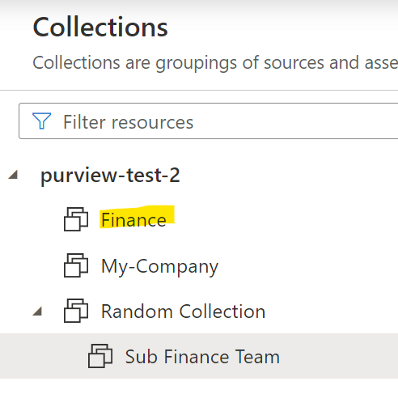

### Overview
::: purviewautomation.collections.PurviewCollections.delete_collections
    options:
        heading_level: 0

!!! important
    - This method only deletes collections that have no children. To delete collections with children (recursive delete), see [Delete Collections Recursively](delete-collections-recursively.md) 
    - Collection names are case sensitive. `My-Company` is different than `my-Company`.

    - To delete collections that also have assets, add the delete_assets parameter see: [Delete Assets Section](#delete-assets)
    

## Examples

### Delete One Collection
If the Purview collections look like this:


Delete `Sub Collection 1`:
```Python
client.delete_collections(collection_names="Sub Collection 1")
```
The output will be printed to the screen:


### Delete Multiple Collections
Deleting multiple collections under different hierarchies is also allowed. If the Purview collections look like this:


Delete `Sub Collection 2` and `Sub Collection 1` by passing in a list:
```Python
client.delete_collections(["Sub Collection 2", "Sub Collection 1"])
```


### Rollback/Safe Delete
When deleting collections, passing in the safe_delete parameter will output the collection/s that were deleted in order to recreate the collection. Think of this as a rollback option.

If Purview looked like this:


Running the code: 
```Python
client.delete_collections(collection_names="Collection To Delete", 
                          safe_delete="client")
```
Will delete the collection in Purview and output (print to the screen) the exact script to recreate the collection again. The same actual and friendly names are used:


Simply copy and run the code to recreate the collection:
```Python
client.create_collections(start_collection='tkhegu', 
                          collection_names='msvebq', 
                          safe_delete_friendly_name='Collection To Delete')
```                                             
The `Collection To Delete` collection is recreated:


### Delete Assets
To delete assets in a collection and delete the collection, use the `delete_assets` parameter with the optional `delete_assets_timeout` option:
!!! Important
    **The Service Principal or user that authenticated/connected to Purview would need to be listed as a Data Curator on the collection in order to delete assets in that collection. For more info, see: [Purview Roles](https://learn.microsoft.com/en-us/azure/purview/catalog-permissions)** 
    
    Deleting assets in a collection is irreversible. Re-scan the deleted assets to add them back to the collection.

    The code will delete all the assets and the collection. To only delete assets in a collection and not delete the collection, see: [Delete Collection Assets](./delete-collection-assets.md)

    The root collection (top level collection) can't be deleted. In the example above, `purview-test-2` is the root collection. To only delete the assets, see: [Delete Collection Assets](./delete-collection-assets.md)


For example, the below collection `Collection To Delete` has 3 assets:


Run the code to delete all 3 assets in the collection and delete the collection as well:


```Python
client.delete_collections(collection_names="Collection To Delete",
                          delete_assets=True)
``` 

The delete_assets parameter has a default timeout of 30 mins. If the collection has a large number of assets, pass in an integer to the delete_assets_timeout parameter to specify a longer or shorter timeframe (in minutes).

For example, the below code will run up to an hour before timing out. The code will also stop when all the assets are deleted. If it only takes one minute to delete all of the assets, the code will stop after a minute:
```Python
client.delete_collections(collection_names="Collection To Delete",
                          delete_assets=True,
                          delete_assets_timeout=60)
```                          


### Handling Duplicate Friendly Names

In the event there's multiple duplicate friendly names/edge cases, see: [Handeling Multiple Duplicate Friendly Names](../handeling-multiple-duplicate-friendly-names.md).


In Purview, the real name (under the hood name) of a collection has to be unique but there can be duplicate friendly names under different hierarchies:


In the above example, the friendly name `Sub Finance Team` appears under two different hierarchies. Under the hood, the two names will be different (different real names).

When trying to delete a collection (or collections) with multiple friendly names, a friendly error will be raised showing the info of the collections and to choose which real name to use:
```Python
client.delete_collections("Sub Finance Team")
```
Will raise a friendly error:


From the above options, you can see the collection info and choose the real name of one of them (or both). Either `zgnm71` or `bn2azu`. Below the `Sub Finance Team` collection under `Finance` will be deleted:

```Python
client.delete_collections(collection_names="zgnm71")
```



### Edge Case Using the force_actual_name parameter
This is used when there are duplicate friendly names across different hierarchies and the real name of one of them is the name you're using. For example, in the below Purview there's two friendly names named `test1`:


Running the command below:
```Python
client.delete_collections("test1")
```
Could output the following (collections were created specifically under the hood in this example to raise this error.):


In the above image, `test1` is listed as a real name. When this rare edge case occurs, set the force_actual_name to True to delete the real `test1` collection (under `My-Company`):
```Python
client.delete_collections("test1", force_actual_name=True)
```
