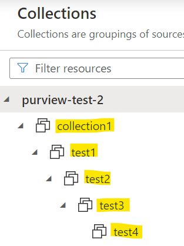
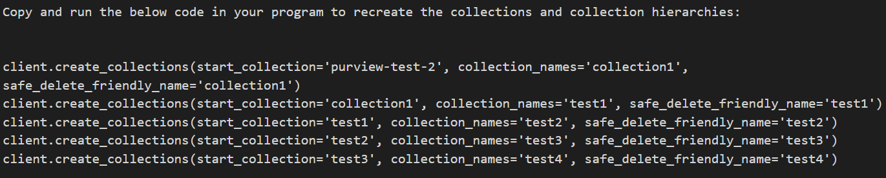
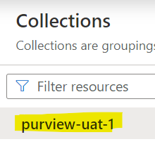
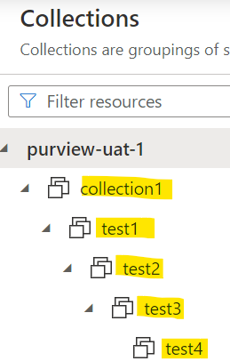

### Overview
::: purviewautomation.collections.PurviewCollections.extract_collections
    options:
        heading_level: 0

## Examples

If the Purview collections look like this:



To extract the exact script to create the hierarchy starting from `collection1`:

```Python
client.extract_collections(start_collection_name="collection1")
```

Will output (print) to the screen the script to recreate the hierarchy:



!!! Important
    The start_collection parameter value may show random strings as the name. This is because the code will grab the original actual name to recreate the hierarchy exactly as it was (same actual and friendly names). For more info on what actual names and friendly names mean, see:  [Purview Names Overview](../how-purview-names-work.md).

The script can be saved for later use or to deploy to other Purview (UAT/PROD) environments. 

For example, another Purview that's used as a UAT Purview:



To recreate the same hierarchy as the original Purview, just update the initial start_collection from `purview-test-2` to the new `purview-uat-1`:

```Python
client.create_collections(start_collection='purview-uat-1', collection_names='collection1',safe_delete_friendly_name='collection1')         

client.create_collections(start_collection='collection1', collection_names='test1', safe_delete_friendly_name='test1')

client.create_collections(start_collection='test1', collection_names='test2', safe_delete_friendly_name='test2')

client.create_collections(start_collection='test2', collection_names='test3', safe_delete_friendly_name='test3')

client.create_collections(start_collection='test3', collection_names='test4', safe_delete_friendly_name='test4')
```

The output will be the exact same hierarchy as the original Purview (same actual and friendly names) so it's consistent across environments:



!!!Info
    Make sure the Service Principal/user is authenticated to the new Purview and assigned the Collection Admin role on the initial start collection (`purview-uat-1` in the example above).


