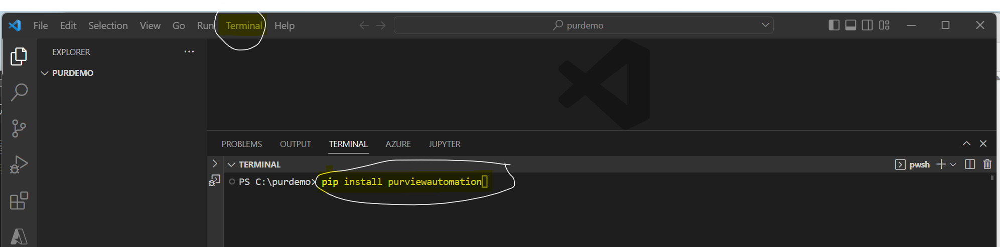

### Welcome
Welcome to Purview Automation! 


### Install purviewautomation

The first step is to install purviewautomation on your favorite code editor (Visual Studio Code, PyCharm, etc.) or add the library to a Synapse Spark Pool or a Databricks cluster.
!!! note 
    As an optional suggestion, ensure pip is updated first by opening a terminal and typing the following:

    ```
    python -m pip install --upgrade pip
    ```

To install in a code editor such as Visual Studio Code, open up a terminal and type:

```Python
pip install purviewautomation
```

### Example Install in Visual Studio Code



Now that the library is installed, we can move to the next section to how to authenticate and connect with Purview. Click on the bottom right of the screen to move to the next section.


<!-- The simplist purviewautomation file could look like this:

```Python
{!../../../docs_src/first_steps/tutorial001.py!}
```

Copy that to a file `main.py`.

!!! note 
    The command `test this command` refers to -->