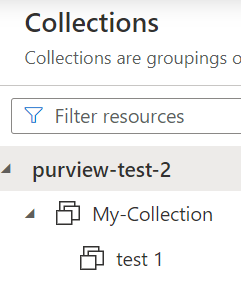

### Overview
::: purviewautomation.collections.PurviewCollections.get_real_collection_name
    options:
        heading_level: 0

## Examples

Pass in either an actual or friendly collection name (For more info on what actual and friendly names mean, see: [Purview Names Overview](../how-purview-names-work.md)). The code will return one of the following:

- The actual name of the collection (if it exists)

- A friendly error stating that the collection doesn't exist (if there's no collection by that name)

- If passing in a friendly name and multiple friendly names exist, an error will return displaying the multiple friendly names in order to choose which to use

For example, if the Purview collections look like this:



To return the actual name of `test 1`:

```Python
print(client.get_real_collection_name("test 1"))
```

Will output the actual name of the collection. In this example, it would output: `mojpnk`.


