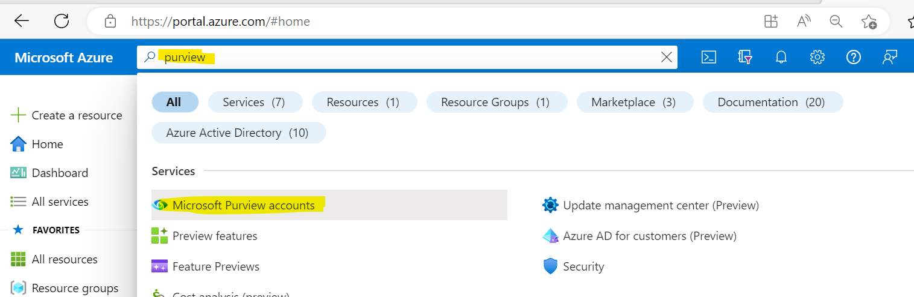

### Overview
::: purviewautomation.collections.PurviewCollections.list_collections
    options:
        heading_level: 0

### Examples

The simpliest code is to print the collections (will provide the most detail)
```Python
print(client.list_collections())
```

Use the pprint (pretty print) parameter to print a cleaner output (print function is not needed)
```Python
client.list_collections(pprint=True)
```

To print only the real name, friendly name, and parent collection names (print function is not needed):
```Python
client.list_collections(only_names=True, pprint=True)
```

To return a list of the collections:
```Python 
collections = client.list_collections()
    for coll in collections:
        print(coll)
```

To return a dictionary of the real, friendly, and parent collection names (real name is the key and friendly/parent collections are the values):
```Python
collection_names = client.list_collections(only_names=True)
for name, value in collection_names.items():
    print(name, value)

# Return just the keys (real names)
for name in collection_names:
    print(name)

# Return just the friendly names or just the parent collection names
for name in collection_names.values():
    friendly_name = name["friendlyName"]
    parent_name = name["parentCollection"] 
```


## Installation

<div class="termy">

```console
$ pip install fastapi

---> 100%
```

</div>

You will also need an ASGI server, for production such as <a href="https://www.uvicorn.org" class="external-link" target="_blank">Uvicorn</a> or <a href="https://github.com/pgjones/hypercorn" class="external-link" target="_blank">Hypercorn</a>.

<div class="termy">

```console
$ pip install "uvicorn[standard]"

---> 100%
```

</div>


``` sh
.
├─ docs/
│  └─ stylesheets/
│     └─ extra.css
└─ mkdocs.yml
```

hello 
